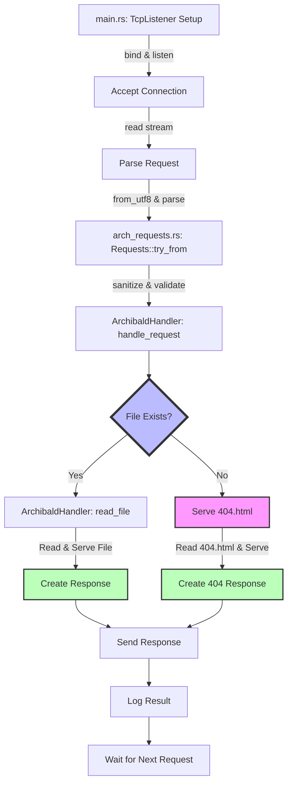

### Detailed Explanation:

- **`main.rs: TcpListener Setup`**: Initializes the `TcpListener` to bind to a specific address and start listening for incoming connections.
- **`Accept Connection`**: Once a connection is accepted, the server begins to process the incoming request.
- **`Parse Request`**: Reads the incoming stream to parse the HTTP request.
- **`arch_requests.rs: Requests::try_from`**: Uses the `Requests::try_from` method to convert the raw request data into a structured `Requests` object. This involves decoding from UTF-8 and parsing the HTTP request components.
- **`ArchibaldHandler: handle_request`**: The `handle_request` method in `ArchibaldHandler` takes over, sanitizing the request path and validating the request.
- **`File Exists?`**: Decision point to check if the requested file exists in the server's file system.
- **`ArchibaldHandler: read_file`**: If the file exists, `read_file` method is called to read the file's contents.
- **`Serve 404.html`**: If the file does not exist, the server attempts to serve a `404.html` page.
- **`Create Response` & `Create 404 Response`**: Based on the outcome, a response is created either by serving the requested file or the `404.html` page.
- **`Send Response`**: The response is then sent back to the client.
- **`Log Result`**: The server logs the result of the request handling.
- **`Wait for Next Request`**: The server then waits for the next incoming request.

This enhanced diagram and explanation provide a clearer view of the function-level interactions within your Rust web server application, focusing on how requests are processed and responses are generated, including the handling of 404 errors.


## Tracking the Flow of Data

When hunting for bugs, I've always jotted down how data enters a binary/application and watch the flow of that data as i use/abuse said binary/application. This gives me the inputs I need to concentrate on and try and abuse. It's often a labour intensive phase but I feel incredibly import. I get why those shipping products do not offer this, but it would be cool if they did.

When looking for bugs, we generally look at three main areas:

1. Sources - Areas where input is supplied from untrusted sources
2. Sinks - Places where malicious behaviour could happen
3. Data Flow - The flow of untrusted data throughout the application

Archibald finally gave me that chance to not only document this but also try it out and this markdown file does just that.

I also thought it useful to include areas where this could be exploited if not correctly handled.

### Startup Process

When Archibald is started, the main() function is called. This can be found in main.rs and this file is mostly a stub for the Server() implementation, which is found in server.rs.

Running cargo run will build the source code and run it, and if there are no errors, should result on a server listening on localhost and port 8080.

In main.rs, we import server.rs first and then set the following environment variables:

```
default_path = format!("{}/static_content", env!("CARGO_MANIFEST_DIR"));
static_path = env::var("ARCHIBALD_STATIC_PATH").unwrap_or(default_path);
```

Once those are set, we define both what to listen on and the port. Then, using our imported Server() function, we tell archibald to use those, with the static path and then run the server.

## Archibald Handler

This function is pretty important as it helps handle incoming requests. We first have _ArchibaldHandler_ which uses the static path value in order to serve static content (index.html for example). We then add a _ServerHandler_ function, which is responsible for handling the actual requests. Here we define what allowed HTTP methods we want via the _Allowedmethods()_, the paths and also what to do if there is an error.

This function also defines the responses, such as statuscodes found in _archibald::http::statuscodes.rs_

#### Sources

In the _Archibaldhandler_ implementation, we take the static_path supplied at the start and define a variable called _path_. If we didn't perform the correct validation of this path, using _fs::canonicalize(path)_, we could control that path via the request in the form of a directory traversal attack.

### Requests & Response

A web server that doesn't respond to HTTP requests is, well, not a web server is it?. Archibald makes use of a request function found in _src::http::requests.rs_ and a response function found in _src::http::response.rs_

A function called _handle_request_ calls both Request and Response.

#### Requests

This function handles all incoming requests made to Archibald and right from the get go, we are expecting three main things:

- Path
- Query String
- Method

If you imagine a request that looks like:

```
GET /name?first=Daniel&last=Cuthbert HTTP/1.1
```

We need to somehow take all of that request, from the buffer, and do something with it. My approach was pretty hacky in this regard, and was:

```
fn parse_request(request: &str) -> Option<(&str, &str)> {
    for (i, c) in request.chars().enumerate() {
        if c == ' ' || c == '\r' {
            return Some((&request[..i], &request[i + 1..]));
        }
    }
    None
}
```

Take the request and string and then add 1 to the index to get the next character.

#### Sinks

The above should scream out to you as a huge attack surface area and one for concern. This is where most attacks will occur, you have 3 areas expecting some form of input.

#### Response

Once we have the request and know how to handle it, we need to return something and this is where _requests.rs_ comes into action.

First, we define a struct called Response

```
pub struct Response {
    statusmessage: String,
    body: Option<String>,
    status_code: StatusCode,
}
```

The contents of these 3 fields get copied to new strings on the heap when we create a new response.

But we need to send something back right? This is where we implement functionality in the form of _Response{}_

This makes use of IoResult to send a stream consisting of the body, status_code and statusmessage.

#### Sinks

Seeing as we are copying these strings onto the heap, this is a potential area of abuse. Depending how this is done, or not, could lead to memory manipulation or corruption. If we are not validating paths, we could also send back sensitive data outside of the static_path.
