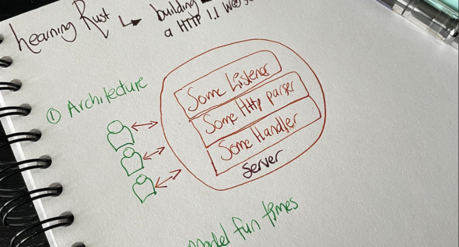
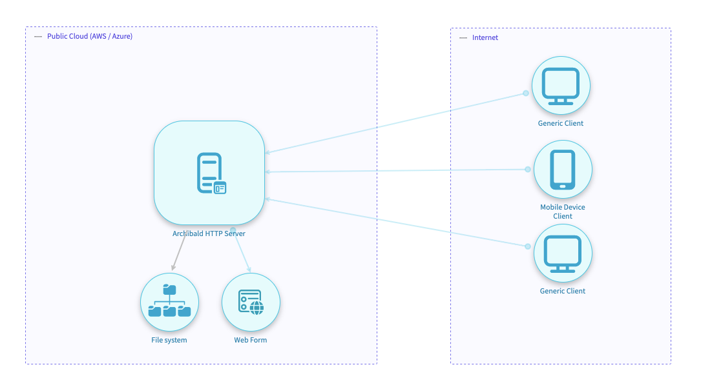
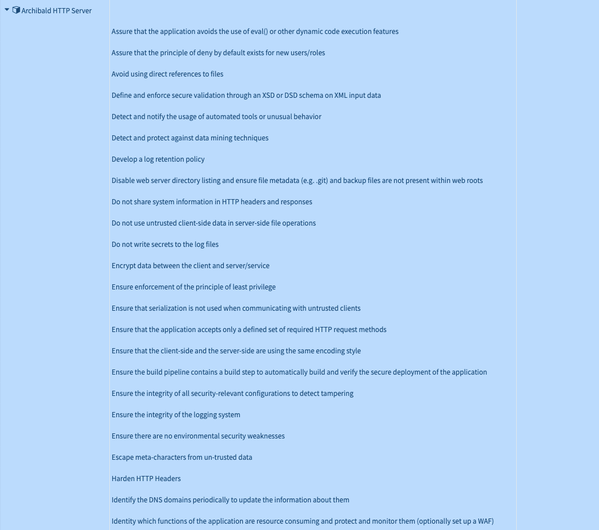

# Archibald

To be a butler, is to be able to maintain an even-temper, at all times. One must have exceptional personal hygiene and look sharp and professional, always. Even when under stress or scrutiny, a butler must remain calm and lead their team through the difficulties.

Archibald is my attempt at learning Rust and writing a HTTP 1.1 web server.

## Architecture



We shall be adopting the KISS approach to building things. I mean how hard is parsing modern web languages and content?

## Threat Modeling



I'm sure no-one will dare to attack this, but just in case, we shall be performing a threat modeling exercise so we understand the threats and code appropriate countermeasures.



## How Does HTTP Actually Work?

For those who aren't aware, Hypertext Transfer Protocol (HTTP) is a [layer 7](https://en.wikipedia.org/wiki/OSI_model) (application) protocol. The whole thing works by requests and responses, the latter being accepted by a server, which provides the answer. HTTP is stateless and this makes it more fun in a way.

It all looks like this:

```
daniel@sexy ~/Code/Archibald -> main -> nc -vv nsa.gov 80
Notice: Real hostname for nsa.gov [23.63.141.16] is a23-63-141-16.deploy.static.akamaitechnologies.com
nsa.gov [23.63.141.16] 80 (http) open
GET / HTTP/1.1
```

That's connecting to the server, on port 80 and asking for the index. It responds:

```
HTTP/1.0 400 Bad Request
Server: AkamaiGHost
Mime-Version: 1.0
Content-Type: text/html
Content-Length: 209
Expires: Tue, 03 May 2022 13:36:08 GMT
Date: Tue, 03 May 2022 13:36:08 GMT
Connection: close

<HTML><HEAD>
<TITLE>Invalid URL</TITLE>
</HEAD><BODY>
<H1>Invalid URL</H1>
The requested URL "&#91;no&#32;URL&#93;", is invalid.<p>
Reference&#32;&#35;9&#46;1ef01602&#46;1651584968&#46;16093878
</BODY></HTML>
Total received bytes: 419
Total sent bytes: 16
```

### Understanding HTTP Messages

There are two types of HTTP messages, requests and responses, each with its own format.

**Requests**

GET (Method)
/ (Path)
HTTP /1.1 (Protocol Version)

**Responses**

HTTP/1.0 (Protocol Version)
400 (Status Code)
Bad Request (Status Message)

We need to model the data and understand how best to handle said data.
Using the above requests and responses, the data we should expect from a client is:

```
GET /user/ID/7 HTTP/1.1\r\n
Host: nsa.gov
User-Agent: Mozilla/5.0 (Windows; U; Windows NT 6.1; en-US; rv:1.9.1.5) Gecko/20091102 Firefox/3.5.5 (.NET CLR 3.5.30729)
Accept: text/html,application/xhtml+xml,application/xml;q=0.9,*/*;q=0.8
Accept-Language: en-us,en;q=0.5
Accept-Encoding: gzip,deflate
```

In order to accept and process the request (the GET method), we'd need to store this into a struct of sorts and using the above method, path, protocol, status code, status message, it should handle it properly and in a secure way.

This might look like:

```
struct Request {
    // We need to store the request body
    method: String,
    query: String,
    path: String,
    body: String,
    statuscode: u16,
    statusmessage: String,
}
```

The above looks good but actually could introduce a bug, for example the HTTP method option could be abused to include payloads other than POST, GET, PUT, PATCH, OPTIONS and DELETE. This needs to be taken into account when designing this struct.

Digging into Rust's capability, it looks like we can solve this by using the [enum](https://doc.rust-lang.org/book/ch06-01-defining-an-enum.html) function.

```
enum Allowedmethods {
    GET,
    POST,
    PUT,
    DELETE,
    HEAD,
    OPTIONS,
    PATCH,
    TRACE,
    CONNECT,
}
```

The pentesters reading this will probably be screaming at me for including OPTIONS and TRACE, but hey you need report fodder right?

But what happens when someone decides to break the rules and not supply any query string? what sick bastard would do that right?

Normally you would use a NULL but Rust doesn't have that but does have an enum called Option, which can encode the concept of a value being present or absent. Without this, it would probably lead to a [Null-pointer](https://owasp.org/www-community/vulnerabilities/Null_Dereference) dereference vulnerability of sorts.

## Disclaimer

This will not be production ready, it might eat your children and cause you to like Lotus Notes. I'm not professing to be an expert in Rust and therefore treat this as pretty dodgy.

## ToDo

There is a lot still that needs doing. Currently the server runs and listens on a port but thats where the fun ends. Here's my roadmap:

1. ~~Respond to requests from clients by looking for a default index.html file in the predefined web root or resource being requested.~~
2. Correctly validate incoming requests using the validation.rs function.
3. Implement correct logging for debugging, audit and analysis.
4. Read configuration files for startup, such as what webroot etc. We can borrow the NGINX format here.
5. We are currently a single-thread butler. That isn't good so we should have many and std::thread could help here.
6. We do nothing with headers in both the requests.rs or the response.rs
